

Dipartimento di Elettronica, Informazione e Bioingegneria
 

.svg)

Corso di Laurea Triennale in Ingegneria Informatica

PROVA  FINALE RETI LOGICHE

Docente:
Prof. Gianluca Palermo

Relazione di:  
Federico Quartieri

Anno accademico 2023/2024

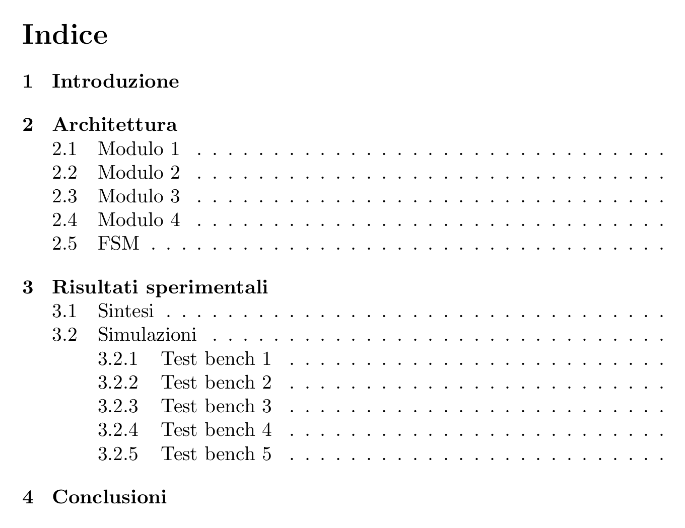

# Introduzione

<html>
&nbsp
</html>

Il progetto consiste nello sviluppo di un componente hardware in VHDL che si interfacci con una memoria esterna. Dato un indirizzo di memoria iniziale e un numero k di elementi da leggere, il componente deve modificare una sequenza di interi in memoria.

Il componente riceverà in input prima un segnale di *reset* e successivamente un segnale di *start* (che indica la richiesta di codifica)

Una volta conclusa l'esecuzione il componente dovrà portare ad 1 il segnale *done*, e aspettare che il segnale *start* in input sia uguale a 0.
Quando il segnale *start* è 0, il componente dovrà portare a 0 il segnale *done*, successivamente potranno essere notificate altre richieste di codifica (segnale *start* = 1), senza che avvenga un reset.

La sequenza in memoria è nella forma seguente:

| $w_1$ | $c_1$ | $w_2$ | $c_2$ | ... | $w_i$ | $c_i$ | ... | $w_k$ | $c_k$ |
| ----- | ----- | ----- | ----- | --- | ----- | ----- | --- | ----- | ----- |

È richiesto leggere $w_i$ e modificare la memoria nel modo seguente:
- $w_i \ne 0 \implies \space\space\space  w_i = w_i \space\space\space\space\space\space\space\space\space; \space\space\space\space\space  c_i = 31 \space\space\space\space\space\space\space\space\space\space\space\space\space\space\space\space\space\space\space\space\forall i = 1,...,k$
- $w_i = 0 \implies \space\space\space w_i = w_{i-1} \space\space\space\space\space; \space\space\space\space\space c_i =c_{i-1} -1 \space\space\space\space\space\space\space\space\space\space\space\forall i = 1,...,k$

Note: 
- $c \in[0,31]$
- $w_{i-1}$ e $c_{i-1}$ sono intesi quelli già aggiornati dal componente

Esempio con memoria prima e dopo l'esecuzione

<table>
	<tr>
		<td style = "font-size:7px; vertical-align:middle; text-align:center">128</td>
	
		<td style = "font-size:7px; vertical-align:middle; text-align:center">0</td>
		
		<td style = "font-size:7px; vertical-align:middle; text-align:center">64</td>
		
		<td style = "font-size:7px; vertical-align:middle; text-align:center">0</td>
		
		<td style = "font-size:7px; vertical-align:middle; text-align:center">0</td>
		
		<td style = "font-size:7px; vertical-align:middle; text-align:center">0</td>
		
		<td style = "font-size:7px; vertical-align:middle; text-align:center">0</td>
		
		<td style = "font-size:7px; vertical-align:middle; text-align:center">0</td>
		
		<td style = "font-size:7px; vertical-align:middle; text-align:center">0</td>
		
		<td style = "font-size:7px; vertical-align:middle; text-align:center">0</td>
		
		<td style = "font-size:7px; vertical-align:middle; text-align:center">0</td>
		
		<td style = "font-size:7px; vertical-align:middle; text-align:center">0</td>
		
		<td style = "font-size:7px; vertical-align:middle; text-align:center">0</td>
		
		<td style = "font-size:7px; vertical-align:middle; text-align:center">0</td>
		
		<td style = "font-size:7px; vertical-align:middle; text-align:center">100</td>
		
		<td style = "font-size:7px; vertical-align:middle; text-align:center">0</td>
		
		<td style = "font-size:7px; vertical-align:middle; text-align:center">1</td>
		
		<td style = "font-size:7px; vertical-align:middle; text-align:center">0</td>
		
		<td style = "font-size:7px; vertical-align:middle; text-align:center">0</td>
		
		<td style = "font-size:7px; vertical-align:middle; text-align:center">0</td>
		
		<td style = "font-size:7px; vertical-align:middle; text-align:center">5</td>
		
		<td style = "font-size:7px; vertical-align:middle; text-align:center">0</td>
		
		<td style = "font-size:7px; vertical-align:middle; text-align:center">23</td>
		
		<td style = "font-size:7px; vertical-align:middle; text-align:center">0</td>
		
		<td style = "font-size:7px; vertical-align:middle; text-align:center">200</td>
		
		<td style = "font-size:7px; vertical-align:middle; text-align:center">0</td>
		
		<td style = "font-size:7px; vertical-align:middle; text-align:center">0</td>
		
		<td style = "font-size:7px; vertical-align:middle; text-align:center">0</td>
	</tr>
	<tr>
		<td style = "font-size:7px; vertical-align:middle; text-align:center">128</td>
	
		<td style = "font-size:7px; vertical-align:middle; text-align:center">31</td>
		
		<td style = "font-size:7px; vertical-align:middle; text-align:center">64</td>
		
		<td style = "font-size:7px; vertical-align:middle; text-align:center">31</td>
		
		<td style = "font-size:7px; vertical-align:middle; text-align:center">64</td>
		
		<td style = "font-size:7px; vertical-align:middle; text-align:center">30</td>
		
		<td style = "font-size:7px; vertical-align:middle; text-align:center">64</td>
		
		<td style = "font-size:7px; vertical-align:middle; text-align:center">29</td>
		
		<td style = "font-size:7px; vertical-align:middle; text-align:center">64</td>
		
		<td style = "font-size:7px; vertical-align:middle; text-align:center">28</td>
		
		<td style = "font-size:7px; vertical-align:middle; text-align:center">64</td>
		
		<td style = "font-size:7px; vertical-align:middle; text-align:center">27</td>
		
		<td style = "font-size:7px; vertical-align:middle; text-align:center">64</td>
		
		<td style = "font-size:7px; vertical-align:middle; text-align:center">26</td>
		
		<td style = "font-size:7px; vertical-align:middle; text-align:center">100</td>
		
		<td style = "font-size:7px; vertical-align:middle; text-align:center">31</td>
		
		<td style = "font-size:7px; vertical-align:middle; text-align:center">1</td>
		
		<td style = "font-size:7px; vertical-align:middle; text-align:center">31</td>
		
		<td style = "font-size:7px; vertical-align:middle; text-align:center">1</td>
		
		<td style = "font-size:7px; vertical-align:middle; text-align:center">30</td>
		
		<td style = "font-size:7px; vertical-align:middle; text-align:center">5</td>
		
		<td style = "font-size:7px; vertical-align:middle; text-align:center">31</td>
		
		<td style = "font-size:7px; vertical-align:middle; text-align:center">23</td>
		
		<td style = "font-size:7px; vertical-align:middle; text-align:center">31</td>
		
		<td style = "font-size:7px; vertical-align:middle; text-align:center">200</td>
		
		<td style = "font-size:7px; vertical-align:middle; text-align:center">31</td>
		
		<td style = "font-size:7px; vertical-align:middle; text-align:center">200</td>
		
		<td style = "font-size:7px; vertical-align:middle; text-align:center">30</td>
	</tr>
</table>

<html>
<html>&nbsp
&nbsp</html>
</html>

# Architettura

<html>
&nbsp
</html>

L'architettura del componente sintetizzato è la seguente

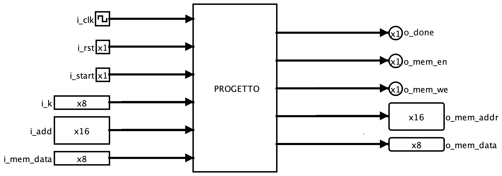

Si interfaccia con un componente di memoria, tramite i seguenti segnali:

- in uscita (e in ingresso in memoria)
	- *o_mem_addr*: indirizzo da cui leggere in memoria
	- *o_mem_data*: dati da scrivere in memoria
	- *o_mem_en*: abilita memoria (se we = 0 la memoria è abilitata solo in lettura)
	- *o_mem_we*: abilita memoria in scrittura
- in ingresso (e in uscita dalla memoria)
	- *i_mem_data*: dati letti dalla memoria

Vengono inoltre forniti i seguenti segnali in ingresso:
- *i_k*: numero di interi da leggere dalla memoria
- *i_add*: indirizzo della memoria da cui iniziare a leggere
- *i_clk*: segnale di clock
- *i_rst*: segnale di reset che ripristina in modo asincrono tutti i registri
- *i_start*: segnale che notifica l'inizio dell'esecuzione

Infine *o_done* è il segnale che il componente dovrà portare ad 1 una volta conclusa l'esecuzione.

Il componente è diviso in 4 sottomoduli e un FSM (Finite State Machine).
Ognuno dei 4 sottomoduli ha un registro (definito in VHDL come process).
Ogni registro ha un segnale di clock e reset, comuni a tutti i registri (sono input dell'architettura generale), i registri modificano il proprio stato sul fronte di salita del clock (se hanno il segnale di load uguale ad 1).

Ogni modulo ha i propri segnali di ingresso e uscita (nei ciruiti in figura mostrati in seguito sono contrassegnati da un etichetta in maiuscolo), che possono essere i segnali sopracitati nell'architettura generale o segnali che vengono determinati dall'fsm o determinano il comportamento della stessa.

Inoltre ogni modulo ha i propri segnali interni (nei circuiti in figura in minuscolo).

I 4 sottomoduli sono i seguenti:

- Modulo 1: aggiornamento del numero di dati da leggere in memoria (k)
- Modulo 2: aggiornamento della credibilità (c)
- Modulo 3: aggiornamento dell'indirizzo di memoria (add)
- Modulo 4: aggiornamento dell'ultimo dato letto dalla memoria (data)

Note per le figure seguenti: 
- Le costanti sono rappresentate in esadecimale per facilitarne la rappresentazione, per esempio nel secondo modulo la costante da sottrarre è rappresentata con 2 cifre essendo un numero a 8 bit.
- Ogni segnale può essere di un numero diverso di bit, questa informazione è visible nei segnali di input e di output 

<html>
<html>&nbsp
&nbsp</html>
</html>

## Modulo 1

<html>
&nbsp
</html>

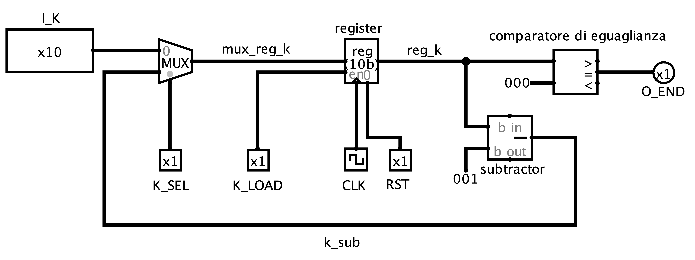

Ingressi:
- *i_k* (input componente)
- *k_sel* (da fsm)
- *k_load* (da fsm): abilita scrittura nel registro

Uscite:
- *o_end* (per fsm): indica se k = 0 (esecuzione terminata)

Costanti:
- 1: valore da sottrarre a k
- 0: valore da comparare con k

---

Il primo multiplexer serve a selezionare se nel registro venga salvato *i_k* (*k_sel* = 0) oppure il valore aggiornato di k (k sottratto di 1). All'inizio dell'esecuzione *k_sel* è uguale a 0 per inizializzare k ad *i_k*, successivamente *k_sel* sarà sempre uguale ad 1 per tutta la durata di una singola esecuzione.
*k_load* viene posto ad 1 per aggiornare il registro.

Questo modulo serve a calcolare il nuovo k, decrementandolo di 1 ad ogni lettura, e a notificare se si è raggiunti la fine di un esecuzione, portando ad 1 il valore di *o_end* se k = 0.

<html>
<html>&nbsp
&nbsp</html>
</html>

## Modulo 2

<html>
&nbsp
</html>

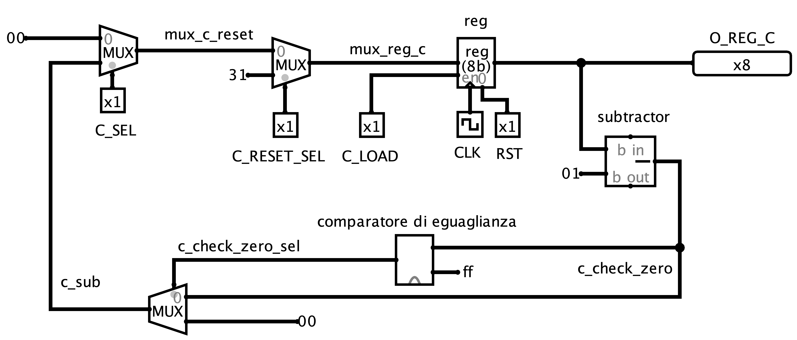

Ingressi:
- *c_sel* (da fsm)
- *c_reset_sel* (da fsm)
- *c_load* (da fsm)

Uscite:
- *o_reg_c* (per output componente)

Costanti:
- 0: valore da assegnare a c
- 31: valore a cui ripristinare c
- 1: valore da sottrarre a c
- 255(ff$_{hex}$): valore da comparare a *c_check_zero*

---

Il primo multiplexer serve a selezionare se nel registro venga salvato 0 (*c_sel* = 0) oppure il valore aggiornato di c (c sottratto di 1). All'inizio dell'esecuzione *c_sel* è uguale a 0 per inizializzare c a 0, successivamente *c_sel* sarà sempre uguale ad 1 per tutta la durata di una
singola esecuzione.
*c_load* viene posto ad 1 per aggiornare il registro.

Il secondo multiplexer serve a ripristinare c a 31 se viene letto in memoria un valore diverso da zero.

Se c = 0 prima della sottrazione, 00000000 - 00000001 = 11111111 (255$_{dec}$ ; ff$_{hex}$).
Per questo motivo il nuovo valore di c, prima di essere riportato in ingresso al primo multiplexer, viene posto a 0 se uguale a 255.

Questo modulo serve a calcolare il nuovo c, aggiornarlo quando necessario e portarlo in uscita affinché venga scritto in memoria quando necessario.

<html>
<html>&nbsp
&nbsp</html>
</html>

## Modulo 3

<html>
&nbsp
</html>

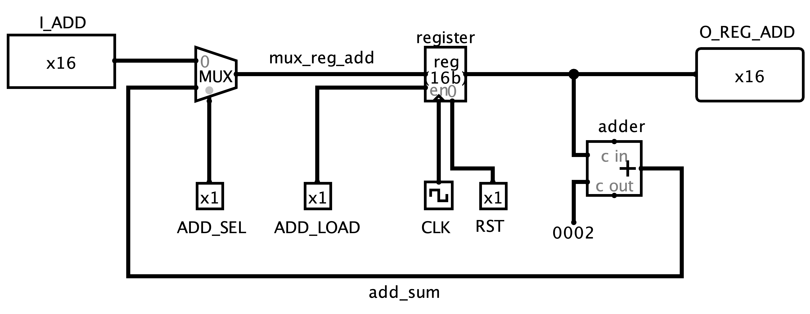

Ingressi:
- *i_add* (da input componente)
- *add_sel* (da fsm)
- *add_load* (da fsm)

Uscite:
- *o_reg_add* (per output componente)

Costanti:
- 2: valore da addizionare ad add

---

Il primo multiplexer serve a selezionare se nel registro venga salvato *i_add* (*add_sel* = 0) oppure il valore aggiornato dell'indirizzo (add addizionato di 2). All'inizio dell'esecuzione *add_sel* è uguale a 0 per inizializzare l'indirizzo a *i_add*, successivamente *add_sel* sarà sempre uguale ad 1 per tutta la durata di una singola esecuzione.
*add_load* viene posto ad 1 per aggiornare il registro.

Questo modulo serve a calcolare il nuovo indirizzo da cui leggere in memoria, incrementandolo di 2 ad ogni lettura, e portarlo in uscita affinché venga utilizzato per definire l'indirizzo su cui scrivere in memoria quando necessario

<html>
&nbsp
</html>

## Modulo 4

<html>
&nbsp
</html>

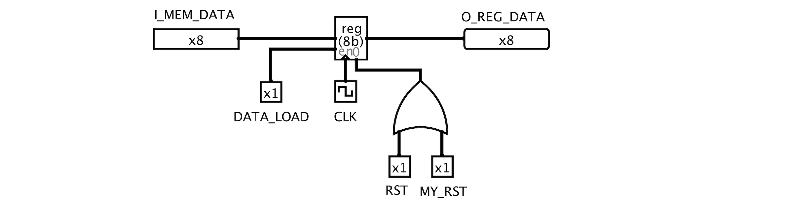

Ingressi:
- *i_mem_data* (da input componente)

Uscite:
- *o_reg_data* (per output componente)

---
*data_load* viene posto ad 1 per aggiornare il registro.

Questo modulo serve ad aggiornare data e portarlo in uscita affinché venga scritto in memoria quando necessario

Il reset non avviene solamente tramite il segnale *rst* (input del componente) ma anche attraverso *my_rst* (segnale determinato dall'fsm), in particolare basta che uno dei due segnali sia posto a 1 affinche il registro resetti il suo stato

<html>
&nbsp
</html>

## FSM

S0-S1: gestione della la fase iniziale, cioè attesa dello start e inizializzazione

S2-S3-S4-S5-S6: è un ciclo completo di lettura di un numero e scrittura della credibilità, in cui nello stato S2 si decide se proseguire con un nuovo ciclo oppure terminare.

SF-SN: gestione della parte di terminazione della singola esecuzione e reset

Per semplicità vengono definiti i default dei segnali e modificati opportunamente negli stati, i segnali di default sono i seguenti:

- *k_sel* = 1
- *k_load* = 0
- *add_sel* = 1
- *add_load* = 0
- *c_sel* = 1
- *c_reset_sel* = 0
- *c_load* = 0
- *data_load* = 0
- *o_mem_we* = 0
- *o_mem_en* = 0
- o_mem_addr = *o_reg_add*
- *o_mem_data* = *o_reg_data*
- *o_done* = 0
- *my_rst* = 0        

Spiegazione dettagliata stati:

<html style = "td{text-align:center;}">

	<table>
		<tr>
			<th style = "text-align:center;">Stato</th>
			<th style = "text-align:center;">Output</th>
			<th style = "text-align:center;">Descrizione</th>
		</tr>
		<tr >
			<td style = "text-align:center; vertical-align: middle;">S0</td>
			<td style = "text-align:center; vertical-align: middle;">/</td>
			<td style = "text-align:center; vertical-align: middle;">attesa dello start</td>
		</tr>
		<tr>
			<td style = "text-align:center; vertical-align: middle;">S1</td>
			<td style = "text-align:center; vertical-align: middle;">k_sel = 0 k_load = 1 add_sel = 0 add_load = 1 c_sel = 0 c_load = 1</td>
			<td style = "vertical-align: middle;">vengono inizializzati i registri di k e add con i valori letti da i_k e i_add e viene inizializzato il registro di c a 0</td>
		</tr>
		<tr>
			<td style = "text-align:center; vertical-align: middle;">S2</td>
			<td style = "text-align:center; vertical-align: middle;">o_mem_en = 1</td>
			<td>viene alzato il segnale per leggere dalla memoria, nello stato successivo o_mem_data conterrà il valore letto da memoria</td>
		</tr>
		<tr>
			<td style = "text-align:center; vertical-align: middle;">S3</td>
			<td style = "text-align:center; vertical-align: middle; white-space:nowrap;">c_load = 1  IF (i_mem_data !=0 ):  c_reset_sel = 1 data_load = 1</td>
			<td>viene scelto se caricare nei registri i valori aggiornati di c e data, in base al valore letto in memoria, questo determinerà poi quali valori verranno scritti in memoria. In particolare se il valore 'w' letto in memoria è 0, il registro di c viene aggiornato (con il suo valore sottratto ad 1) e quello di data non viene aggiornato. Se invece viene letto un valore diverso da 0, il registro di c viene resettato a 31 e quello di data viene aggiornato con il valore appena letto</td>
		</tr>
		<tr>
			<td style = "text-align:center; vertical-align: middle;">S4</td>
			<td style = "text-align:center; vertical-align: middle;">o_mem_en = 1 o_mem_we = 1</td>
			<td>vengono alzati i segnali per scrivere in memoria, di default il valore scritto in memoria è quello letto dal registro 'data' nella posizione letta dal registro 'add', quindi nel possimo stato verrà sovrascritto il valore 'w' in memoria; in base allo stato S3 verrà sovrascritto il valore 'w' appena letto o quello salvato precedentemente nel registro</td>
		</tr>
		<tr>
			<td style = "text-align:center; vertical-align: middle;">S5</td>
			<td style = "text-align:center; vertical-align: middle; white-space:nowrap; ">o_mem_en = 1 o_mem_we = 1 o_mem_addr = o_reg_add + 1 o_mem_data = o_reg_c</td>
			<td style = "vertical-align: middle;" >vengono alzati i segnali per scrivere in memoria e vengono modificati i valori di o_mem_data e o_mem_addr affinché venga scritta la credibilità nell'indirizzo successivo ad add</td>
		</tr>
		<tr>
			<td style = "text-align:center; vertical-align: middle;">S6</td>
			<td style = "text-align:center; vertical-align: middle;">k_load = 1 add_load = 1</td>
			<td>è finito un ciclo di aggiornamento della memoria, vengono aggiornati i valori di k e add nel registro, alzando i segnali di load dei registri</td>
		</tr>
		<tr>
			<td style = "text-align:center; vertical-align: middle;">SF</td>
			<td style = "text-align:center; vertical-align: middle;">o_done = 1</td>
			<td>è finita un esecuzione (sono stati letti k coppie di numeri), viene quindi alzato il segnale o_done</td>
		</tr>
		<tr>
			<td style = "text-align:center; vertical-align: middle;">SN</td>
			<td style = "text-align:center; vertical-align: middle;">my_reset = 1</td>
			<td>dopo la fine dell'esecuzione, quando viene abbassato il segnale di start, viene abbassato il segnale o_done e alzato il segnale di reset, che inizializza il registro data</td>
		</tr>
	</table>

</html>

<html>
<html>&nbsp
&nbsp</html>
</html>

# Risultati sperimentali

<html>
&nbsp
</html>

## Sintesi

**Timing Report:**
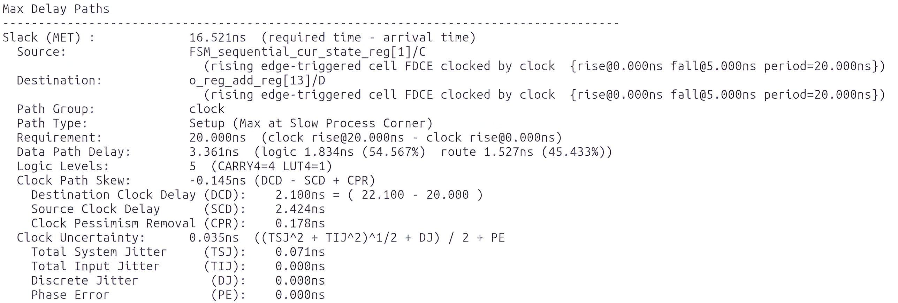

<html>
&nbsp
</html>

L'esecuzione di un ciclo di clock ha una durata di 3.361ns, coerentemente con la richiesta di essere minore di 20ns.

<html>
&nbsp
</html>

**Utilization Report:**
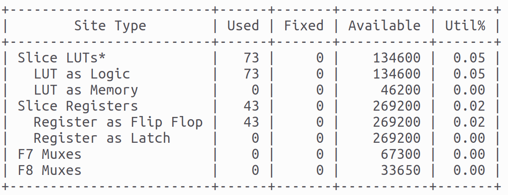

Non sono stati sintetizzati registri di tipo Latch, ma esclusivamente di tipo Flip Flop.

## Simulazioni

### Test bench 1

Obiettivo: controllare il caso limite in cui la memoria non ha dati e k = 0.

Memoria iniziale= []
Memoria dopo esecuzione = []

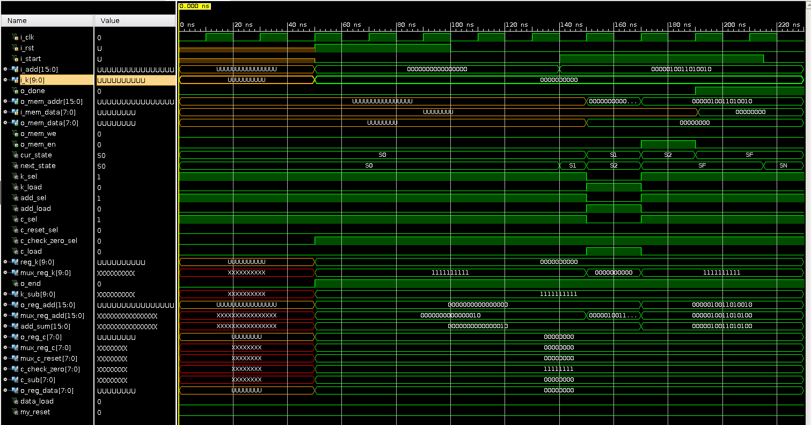

Come da specifica, dopo il segnale di *start*, il componente nello stato S2 alza il segnale *o_end* (poiché k = 0) e quindi passa allo stato SF, alzando il segnale *o_done*.

### Test bench 2

Obiettivo: controllare il caso limite in cui la memoria non è vuota ma k = 0.

scenario 1 = [128, 0,  64, 23,   0,  12,  0,  71,  0,  0,  14,  0,  0,  0, 100,  0, 1,  0, 91,  0, 5,  0, 23,  0, 200,  0,   0,  0]
scenario 1 dopo esecuzione = [128, 0,  64, 23,   0,  12,  0,  71,  0,  0,  14,  0,  0,  0, 100,  0, 1,  0, 91,  0, 5,  0, 23,  0, 200,  0,   0,  0]

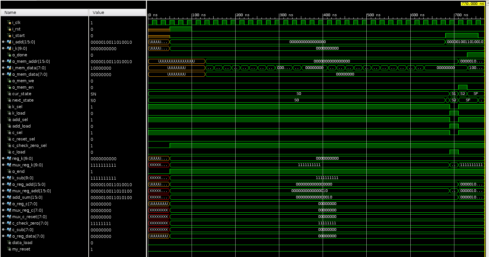

Come da specifica, indipendentemente dalla memoria, poiché k = 0, si ha la stesso comportamento del test bench 1.

### Test bench 3

Obiettivo: controllare il caso limite in cui ci sono più start, nel caso specifico 2 start.

scenario 1 = [128, 0,  64, 0,   0,  0,  0,  0,  0,  0,  0,  0,  0,  0, 100,  0, 1,  0, 0,  0, 5,  0, 23,  0, 200,  0,   0,  0]
scenario 1 dopo esecuzione = [128, 31, 64, 31, 64, 30, 64, 29, 64, 28, 64, 27, 64, 26, 100, 31, 1, 31, 1, 30, 5, 31, 23, 31, 200, 31, 200, 30]

scenario 2 = [0, 0, 0, 0, 64, 0,   0,  0,  0,  0,  0,  0,  0,  0,  0,  0, 150,  0, 1,  0, 0,  0, 5,  0, 23,  0, 0,  0,   0,  0]
scenario 2 dopo esecuzione = [0, 0, 0, 0, 64, 31, 64, 30, 64, 29, 64, 28, 64, 27, 64, 26, 150, 31, 1, 31, 1, 30, 5, 31, 23, 31, 23, 30, 23, 29]

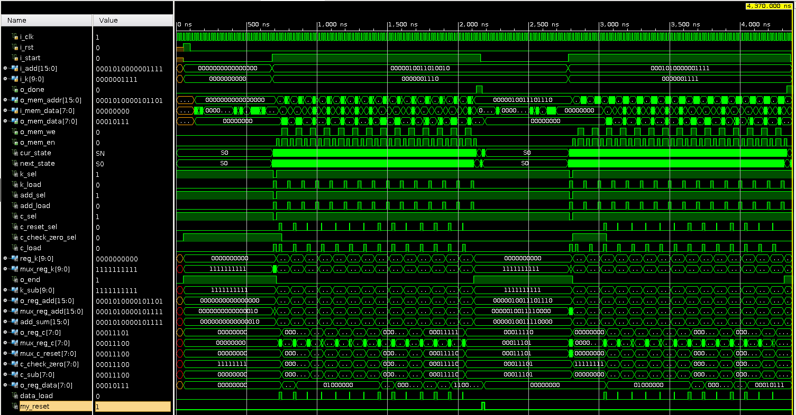

Come da specifica, una volta conclusa la prima esecuzione, viene portato il segnale *o_done* a 1 e successivamente portato a 0 una volta abbassato il segnale di *start*.
Successivamente il componente resetta il registro *reg_data* e rimane nello stato S0 fino a quando non riceve il segnale di *start*, una volta ricevuto, processa la seconda richiesta di codifica correttamente

Il reset di *reg_data* una volta finita un esecuzione viene reso necessario dalla possibilità che lo scenario successivo abbia uno 0 come primo numero letto, come accade in questo caso di test.

### Test bench 4

Obiettivo: controlla il caso limite in cui c'è un reset durante l'esecuzione.

scenario 1 = [128 0,  64, 0,   0,  0,  0,  0,  0,  0,  0,  0,  0,  0, 100,  0, 1,  0, 0,  0, 5,  0, 23,  0, 200,  0,   0,  0]
scenario 1 dopo esecuzione = [128, 31, 64, 31, 64, 30, 64, 29, 64, 28, 64, 27, 64, 26, 100, 31, 1, 31, 1, 30, 5, 31, 23, 31, 200, 31, 200, 30]

scenario 2 = [0, 0, 0, 0, 64, 0,   0,  0,  0,  0,  0,  0,  0,  0,  0,  0, 150,  0, 1,  0, 0,  0, 5,  0, 23,  0, 0,  0,   0,  0]
scenario 2 dopo esecuzione = [0, 0, 0, 0, 64, 31, 64, 30, 64, 29, 64, 28, 64, 27, 64, 26, 150, 31, 1, 31, 1, 30, 5, 31, 23, 31, 23, 30, 23, 29]

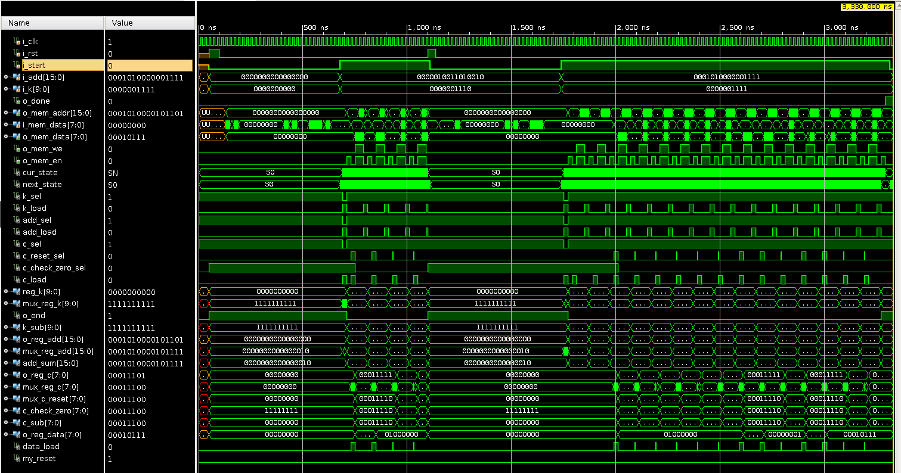

Come da specifica, il componente, una volta ricevuto il segnale di *reset*, resetta tutti i registri e torna nello stato S0, una volta ricevuto un nuovo segnale di *start* processa la nuova richiesta di codifica correttamente.

### Test bench 5

Obiettivo: controllare il caso limite in cui la credibilità scende fino a 0, in particolare viene testato il funzionamento del controllo di c non negativo del modulo 2.

scenario 1 = [128, 0,    0,  0,   0,  0,   0,  0,   0,  0,   0,  0,   0,  0,   0,  0,   0,  0,   0,  0,   0,  0,   0,  0,   0,  0,   0,  0,   0,  0,   0,  0,   0,  0,   0,  0,   0,  0,   0,  0,   0,  0,   0,  0,   0, 0,   0, 0,   0, 0,   0, 0,   0, 0,   0, 0,   0, 0,   0, 0,   0, 0,   0, 0,   0, 0,   0, 0, 108,  0,   0,  0]
scenario 1 dopo esecuzione = [128, 31, 128, 30, 128, 29, 128, 28, 128, 27, 128, 26, 128, 25, 128, 24, 128, 23, 128, 22, 128, 21, 128, 20, 128, 19, 128, 18, 128, 17, 128, 16, 128, 15, 128, 14, 128, 13, 128, 12, 128, 11, 128, 10, 128, 9, 128, 8, 128, 7, 128, 6, 128, 5, 128, 4, 128, 3, 128, 2, 128, 1, 128, 0, 128, 0, 128, 0, 108, 31, 108, 30]

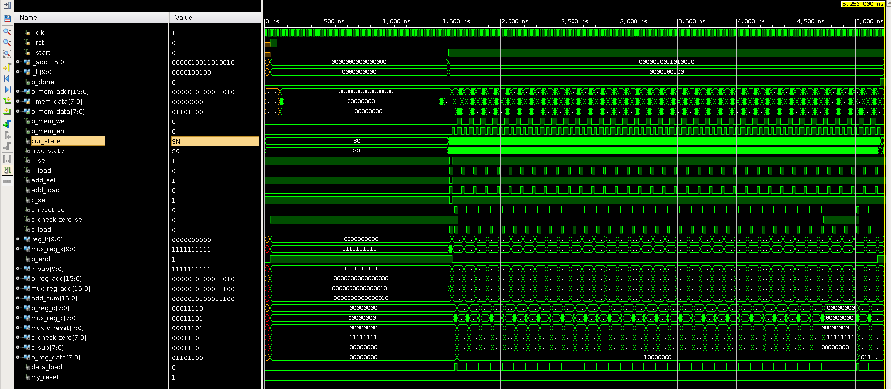

Come da specifica, la credibilità, una volta raggiunto il valore 0, rimane tale e non scende sotto zero, successivamente, una volta che viene letto un numero diverso da zero, viene resettata correttamente a 31.

# Conclusioni

Il componente è stato testato non esclusivamente sui test bench commentati, ma su un elevato numero di essi, i 5 commentati sono di maggior valenza esplicativa in quanto valutano specifici casi limite. Il componente supera correttamente tutti i test bench sia in modalità behavioral che post synthesis.
Il comportamento in modalità behavioral è analogo a quello del componente sintetizzato, anche grazie all'assenza di un involontaria introduzione di registri di tipo latch.
Inoltre i vincoli di clock vengono ampiamente rispettati, con un'esecuzione massima per ciclo di clock di 3.361ns, ben al di sotto del vincolo di 20ns.

Per quanto riguarda le scelte progettuali ho utilizzato come FSM una macchina di Mealy.
Sarebbe stato possibile dividere lo stato S3 in due stati, uno raggiunto se *i_mem_data* = 0, l'altro se *i_mem_data* != 0, affinché le uscite in ognuno di questi due stati dipendesse soltanto dallo stato e non dagli ingressi, come per ogni altro stato. Questo avrebbe reso l'FSM una macchina di Moore.
Tuttavia ho preferito utilizzare uno stato in meno piuttosto che utilizzare una macchina di Moore.

